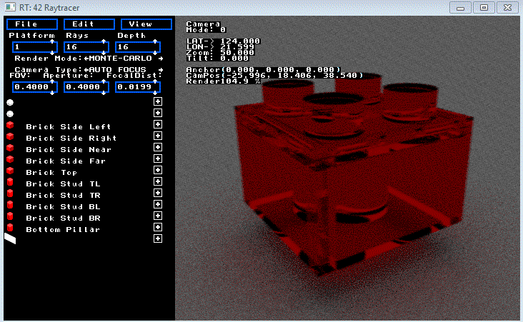
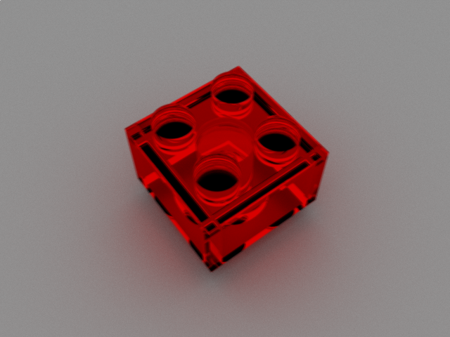

# RT
A 3d raytracing program (42 team project)

Exported BMP image of render by Monte-Carlo path tracing with a ray-per-pixel amount  of 1024 and a depth of 24

Below are the features (current features are marked with '•' and projected features are marked with '-'):

# Features:
* Cross-platform (windows, mac, linux), using SDL2 and OpenCL
* Realtime (no unnecessary renders done, 60 fps - depending on the quality of render currently set and the GPU)
* OpenCL GPU acceleration, to lessen the usual lag of a raytracer (and maybe scale2x or hq2x if needed)
* Fully controllable camera, with all 3 clicks and/or arrow keys
* A configuration file to store properties between program executions
* UI pane allowing the user to modify any of the camera's properties
* UI pane allowing the user to modify any of the scene's properties
* UI list of objects within the scene with property expanding and scrollbar controls
* I/O functions accessible through the UI for file opening/importing and saving
* A random RT file generator
* [TODO] Clipboard copy/pasting of data within the program
* [TODO] Selecting objects on click, and moving/rot/scaling them with keys
* [TODO] Skybox (currently background colors, or textured giant primitives can be used to this effect)

# Light Features:
* Primitive-shaped lights
* Monte-Carlo path-tracing
* [TODO] Bi-directional path-tracing
* Reflection (mirror surfaces)
* Refraction (transparent surfaces)
* fresnel reflections (glassy surface highlighting)
* [TODO] caustic lights (refractions on shadows)
* [TODO] Black holes (ray curving)

# Primitives & Shapes:
* Plane (infinite, and finite rectangle and disk)
* Triangle
* Cube
* Sphere
* Cylinder (infinite, and finite)
* Cone (infinite and finite)
* Saddle
* Paraboloid
* Hyperboloid
* [TODO] OBJ triangular mesh models (intersecting rays in world space)
* [TODO] Mobius twist
* [TODO] Torus knot
* [TODO] 3D Epitrochoid/Hypocycloid
* [TODO] Fractals
